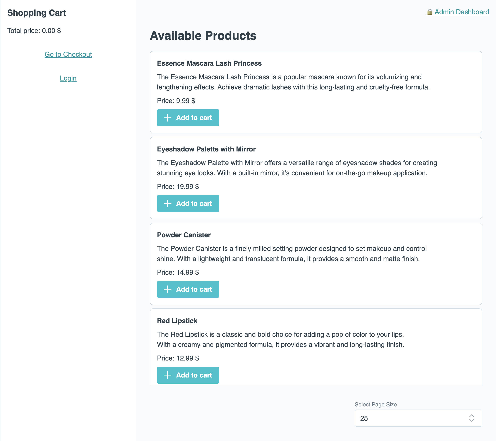
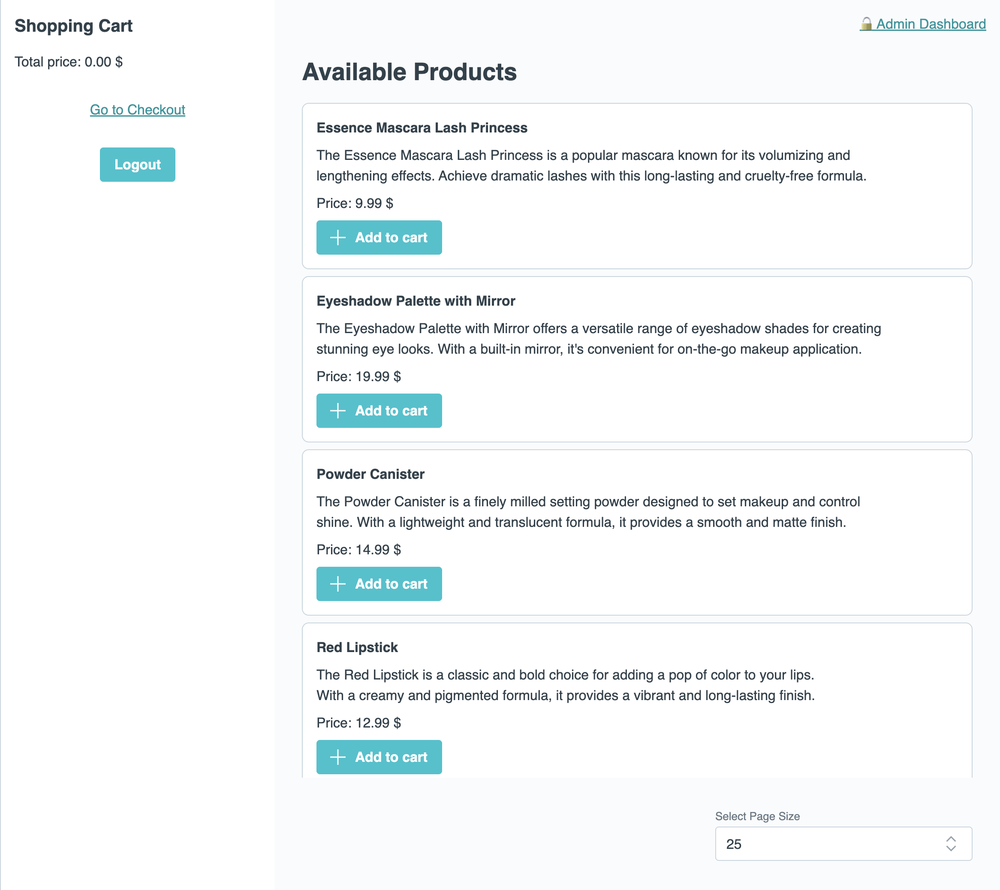

# Exercise 02 Advanced Routing

The goal of this exercise is to learn how to guard routes, add redirects, and lazy load routes.

## 📝 Tasks

- [ ] Add two new routes:
  - [ ] `/admin`: This route should load the `AdminView.vue` component. It should only be reachable if the user is an admin. Use a global guard for this.
    > 💡 We added a simulated login logic for you. Simply import `useAuthStore` from `@/stores/auth`. It exports the `isAdmin`, `isAuthenticated` booleans as well as the `login` and `logout` functions.
  - [ ] `/login`: This route should load the `LoginView.vue` component. If an authenticated user tries to visit this page, it should redirect to the home route. Use a per-route guard for this.
    > 💡 Again, you can use the `useAuthStore` function here, as it also exports `isAuthenticated`.
- [ ] Lazy load some routes. Think about it: Which routes make sense to lazy load?

> 💪 Pro challenge: When clicking on the Admin Dashboard link as a non-authenticated user and then logging in as an admin, I want to be redirected to the Admin Dashboard instead of the home page. But only if I am an admin!

## 🖼️ Example Result

## 💡 Help

- Vue Router documentation:
  - [Navigation Guards](https://router.vuejs.org/guide/advanced/navigation-guards.html)
  - [Lazy Loading Routes](https://router.vuejs.org/guide/advanced/lazy-loading.html)
