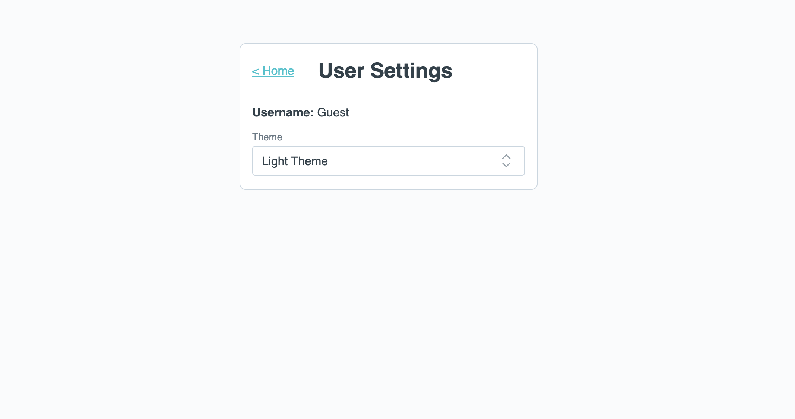

# Exercise 04 Advanced Pinia with Local Storage

The goal of this exercise is to learn how to persist state in local storage together with pinia.

## 📝 Tasks

- [ ] Add a new view for user settings:
  - [ ] Add a new route for `/user-settings`: This route should load the `UserSettingsView.vue` component.
    > 💡 We already added a partially implemented `UserSettingsView.vue` in `/src/views` directory
- [ ] Set up the link to the user settings page within the HomeView (beside the admin link)
- [ ] Find a place for where to add the user settings state
  - [ ] Add a variable for a username
  - [ ] Add a state variable for the theme
- [ ] On the UserSettingsView the user can switch between 'dark' and 'light' theme
  > ℹ️ Switch themes, refresh the browser and realize that your selection is reset
- [ ] Now find a way to persist the theme selection upon refresh (or tab close)

### 💪 Bonus challenge:

- [ ] Find a way to bind the selected theme with the actual color scheme so that the colors adjust dynamically.
- [ ] When the user is logged in as an admin, allow the username in the user settings view to be changed. Persist the username in local storage as well.
  - [ ] Also add the username to the HomeView shown within the Link to the user settings page.

## 🖼️ Example Result

## 💡 Help

- [Local Storage](https://developer.mozilla.org/en-US/docs/Web/API/Window/localStorage)
