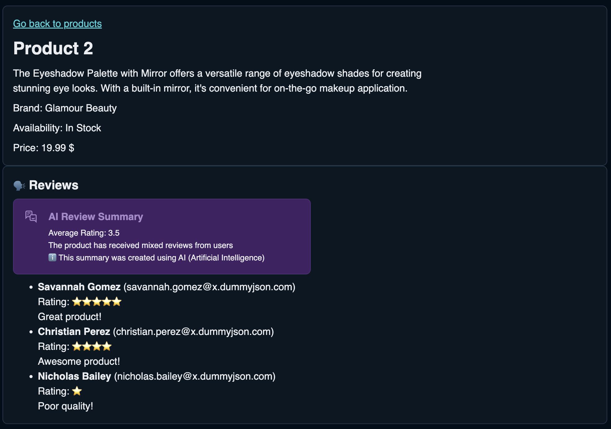

# Exercise 05 Api Client and Mocking

The goal of this exercise is to learn how to use a api client and mock data that is not available yet.

## 📝 Tasks

- [ ] Generate an API client:
  - [ ] Generate the api client from the given products specification file (`/apiSpecification/products_api_spec.yaml`).
    > ℹ️ All needed packages are already installed in the repo. The script command for generating the spec can be found in the package.json
  - [ ] Use the generated client to fetch products. Replace the old fetch call with it.

- [ ] Add Reviews, see [ProductView.vue](./src/views/ProductView.vue):
  - [ ] Add a section for reviews to product details page
  - [ ] Find the product reviews and render them as a list

☝️ As the service is not ready yet, we need to mock the ai endpoint ourselves to get summaries of the reviews.

- [ ] Mock AI summary:
  - [ ] Setup Mock Service Worker (MSW) to be enabled under development (check the [docs](https://mswjs.io/))
    > ℹ️ All needed packages are already installed in the repo.
  - [ ] Configure a mock for the HTTP GET method. The AI summary we need will be available under
        `/api/ai/reviews/[id]/summary`
  - [ ] Think of a good place for where to handle ai related data in your app
  - [ ] Add a fetch call there for the ai summary
  - [ ] Render the ai summary text in a box above the reviews. Also add a info mark that says that the text is created by AI.

- [ ] 💪 Bonus challenges:
  - [ ] Implement proper error handling for the fetch
  - [ ] Add a loading state

## 🖼️ Example Result

## 💡 Help

- Vue documentation:
  - [HeyApiClient](https://heyapi.dev/)
  - [MockServiceWorker](https://mswjs.io/)
  - [Vue](https://vuejs.org/)
